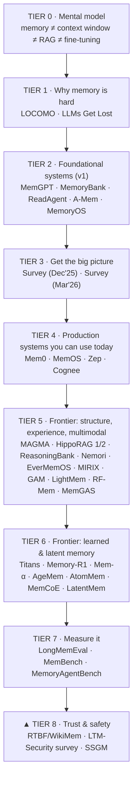
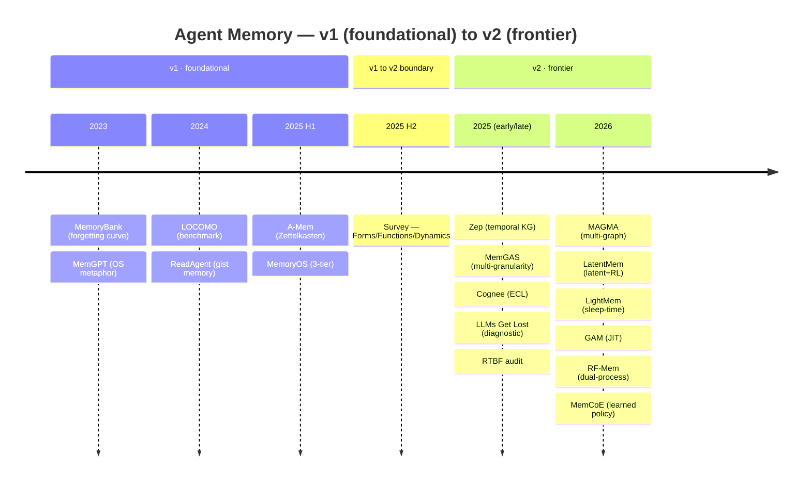
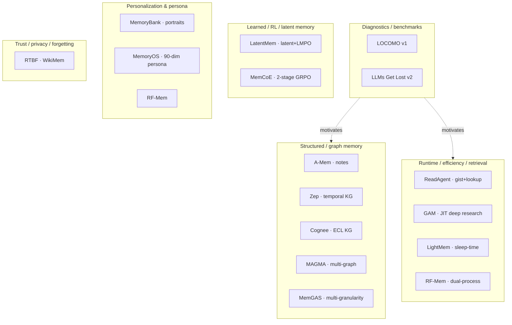
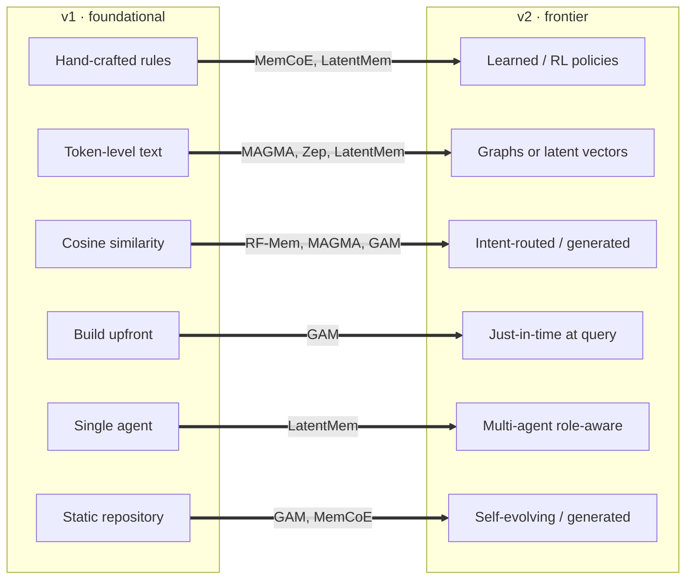
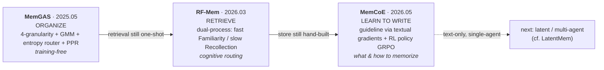
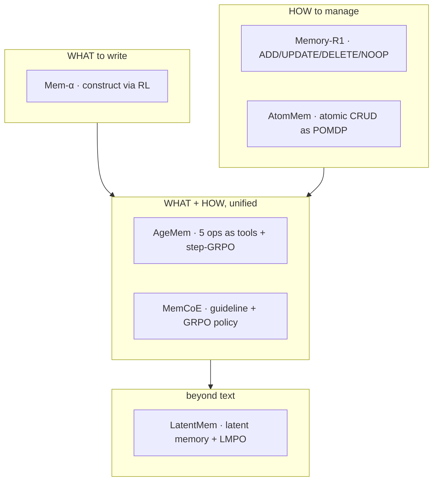
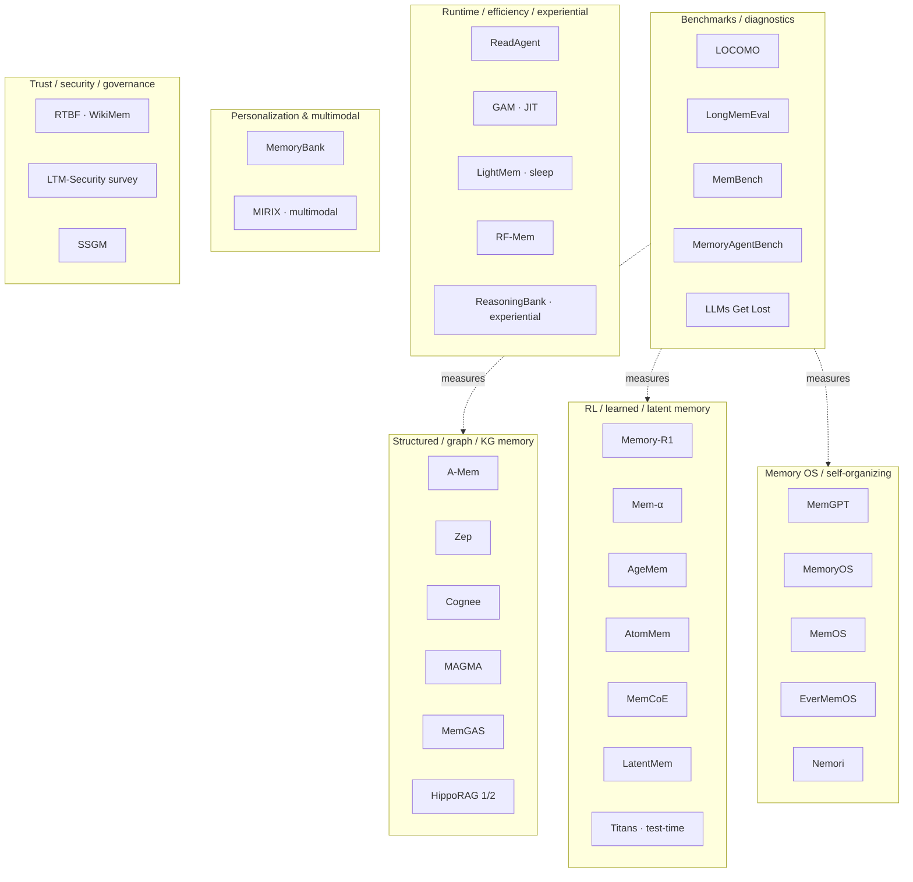

# Agent Memory — A Reader's Guide & v1→v2 Map

> **What is "agent memory"?** It's the machinery that lets an LLM agent remember across turns, sessions, and tasks — storing what it learns, retrieving it when relevant, and updating or forgetting it over time. It's distinct from a bigger context window (that's just more RAM), from RAG (static external knowledge), and from raw fine-tuning. This folder collects **37 key papers** spanning the field's foundational era through the 2026 frontier, each with a hand-written `_notes.md` summary.

This README is the map. **v1** = foundational era (2023–2025); **v2** = the 2026 frontier (plus a few late-2025 papers that already point at it). The dividing survey, *Memory in the Age of AI Agents* (Dec 2025), sits on the boundary and predicts most of what v2 delivers.

## How this folder is organized

- Every paper is a **pair**: `<name>.pdf` (the paper) + `<name>_notes.md` (a detailed study summary with real numbers, architecture, ablations, and a "Where it sits (v1/v2)" note). Read the notes first; open the PDF when you want the details.
- This `README.md` is the navigation layer: the learning path (below), the v1→v2 analysis (§1–4), the full catalog (§5), and a "what to read for what" index (§6).
- Diagrams render on GitHub (Mermaid). If you're reading in a plain editor, they appear as code blocks.

---

## 🧭 Start here — the totem pole (a learning path)

New to agent memory? Climb the pole from the bottom up. Each tier builds on the one below; you can stop at any tier and already have a coherent picture. Pick one or two papers per tier (the **bold** ones are the recommended entry point for that tier).

| Tier | Goal | Read | Why |
|---|---|---|---|
| **0** | Frame the problem | (this README's intro) | Know what memory *is* and isn't before reading systems |
| **1** | Feel the pain | **LOCOMO**, LLMs Get Lost | Two diagnostics showing agents forget across long conversations / multi-turn tasks |
| **2** | Foundational moves | **MemGPT** (OS metaphor), MemoryBank (forgetting curve), ReadAgent (gist+lookup), **A-Mem** (self-organizing notes), MemoryOS (3-tier) | The core ideas every later system remixes |
| **3** | The big picture | **Survey: *Memory in the Age of AI Agents*** (Forms/Functions/Dynamics), then *Memory for Autonomous LLM Agents* (control-policy view) | Two complementary taxonomies; read after you've seen a few systems so the categories mean something |
| **4** | Build something | **Mem0**, MemOS, Zep, Cognee | Open-source production memory you can `pip install`; Mem0 is the field's standard baseline |
| **5** | Frontier — structure & experience | **MAGMA** (multi-graph), HippoRAG 1/2 (KG+PageRank), **ReasoningBank** (learn from success+failure), Nemori, EverMemOS, MIRIX (multimodal), GAM (just-in-time), LightMem (efficiency), RF-Mem, MemGAS | How 2026 systems organize, generate, and route memory |
| **6** | Frontier — learned & latent | **Titans** (test-time neural memory), Memory-R1 / Mem-α / **AgeMem** / AtomMem (RL memory ops), MemCoE, LatentMem | The biggest shift: memory policies *learned by RL* instead of hand-written |
| **7** | Evaluate | **LongMemEval**, MemBench, MemoryAgentBench | How the field measures progress; pick your benchmark before claiming a win |
| **8** | Trust & safety | **LTM-Security survey**, SSGM, RTBF/WikiMem | Persistent memory is an attack surface and a privacy/compliance liability |

**Three fast on-ramps depending on who you are:**
- *Engineer who wants to ship:* Tier 1 → Tier 4 (Mem0/Zep) → pick a benchmark in Tier 7.
- *Researcher:* Tier 2 → Tier 3 surveys → Tier 5–6 frontier → Tier 8.
- *Just curious:* read MemGPT's notes, then this README's §2 comparison table.

---

## 1. The roster

### v1 — foundational (2023–2025)
| Paper | Year | One-line |
|---|---|---|
| MemGPT | 2023.10 | OS virtual-memory metaphor; LLM self-pages context ↔ external DB |
| MemoryBank | 2023.05 | Ebbinghaus forgetting curve + user portraits; plug-and-play |
| ReadAgent | 2024 ICML | Fuzzy-trace gist memory; LLM-as-retriever beats embedding RAG |
| LOCOMO | 2024.02 | Benchmark; "observations > raw dialog > summaries" for retrieval |
| A-Mem | 2025.02 | Zettelkasten atomic notes; link generation + memory **evolution** |
| MemoryOS | 2025.05 | 3-tier STM/MTM/LPM; segment-page; heat-based eviction; 90-dim persona |
| *Survey* | 2025.12 | Forms / Functions / Dynamics taxonomy; boundary document |

### v2 — frontier (2025–2026)
| Paper | Method | Year | One-line |
|---|---|---|---|
| MAGMA | MAGMA | 2026.01 | Disentangled multi-graph (temporal/causal/semantic/entity) + intent-routed retrieval + dual-stream write |
| LatentMem | LatentMem | 2026.03 | Learnable **latent** memory (not text), role-aware, RL-trained composer (LMPO), multi-agent |
| Zep | Zep/Graphiti | 2025.01 | Bi-temporal knowledge graph; production framework |
| Multi-Granularity | **MemGAS** | 2025.05 | 4-level granularity + GMM association + entropy granularity router + PPR (training-free) |
| Cognee | Cognee | 2025.05 | Modular ECL (Extract-Cognify-Load) KG framework; TPE hyperparameter optimization |
| LightMem | LightMem | 2026 ICLR | Atkinson-Shiffrin 3-stage; sleep-time offline consolidation; extreme efficiency |
| GAM | GAM | 2025.11 | Just-in-Time compilation; dual-agent Memorizer + Researcher; runtime deep research |
| Evoking User Memory | **RF-Mem** | 2026.03 | Cognitive dual-process retrieval (fast Familiarity / slow Recollection); personalization |
| Learning How/What | **MemCoE** | 2026.05 | Cognition-inspired 2-stage: learn guideline + RL memory policy (multi-turn GRPO) |
| RTBF audit | WikiMem | 2025.07 | GDPR right-to-be-forgotten; quantify parametric memorization before unlearning |
| LLMs Get Lost | — | 2025.05 | **Diagnostic** (not a system): multi-turn drop ~39%; motivates memory/context mgmt |

> Two papers are not memory *systems*: **LLMs Get Lost** (diagnostic, like LOCOMO) and **RTBF audit** (privacy/forgetting of parametric memory). They are kept here for the broader picture but flagged as off-axis.

### Timeline (renders on GitHub)

### Landscape map — how the papers cluster

---

## 2. Cross-generation comparison by dimension

| Dimension | v1 (foundational) | v2 (frontier) | Exemplar shift |
|---|---|---|---|
| **Control policy** | Hand-crafted rules & heuristics (FIFO, forgetting curve, heat scores, fixed thresholds) | **Learned / RL-driven** memory policies | A-Mem fixed link+evolve rules → MemCoE (GRPO), LatentMem (LMPO) |
| **Memory representation** | Token-level explicit text (notes, summaries, observations) | Disentangled **graphs** or compressed **latent** vectors | Flat notes → MAGMA multi-graph / Zep temporal-KG / LatentMem latent |
| **Retrieval** | Cosine similarity (± LLM reasoning over text) | **Intent / causal-routed** or **on-demand generated** | top-k embeddings → MAGMA intent routing, RF-Mem dual-process, GAM JIT deep research |
| **When memory is built** | Eagerly, upfront (write-time summarization/structuring) | **Just-in-time** at query time (keep raw, compile context on demand) | MemoryBank/A-Mem build-upfront → GAM JIT "deep research" |
| **Structure depth** | Flat → planar notes → 3-tier hierarchy | Multi-graph, multi-granularity, learned latent space | MemoryOS 3-tier → MemGAS 4-granularity + router, MAGMA 4 graphs |
| **Agent scope** | Single agent, mostly conversational | **Multi-agent**, role-aware shared memory | single-agent → LatentMem role-conditioned multi-agent memory |
| **Efficiency posture** | Heavy: LLM call per memory op (A-Mem, MemoryOS) | Explicit **efficiency engineering** (pre-compress, sleep-time, fewer calls) | A-Mem/MemoryOS heavy → LightMem (up to 38× fewer tokens, 30× fewer API calls) |
| **Cognitive grounding** | Loose analogies (OS, forgetting) | Specific dual-process / consolidation theories operationalized | Ebbinghaus decay → CLS fast-slow (MAGMA), recollection/familiarity (RF-Mem), Atkinson-Shiffrin + sleep (LightMem) |
| **Consolidation** | Eviction + recursive summary (synchronous) | **Async / offline "sleep-time"** consolidation off the critical path | MemGPT recursive summary → MAGMA slow-path, LightMem sleep-time |
| **Forgetting** | Utility-driven decay of external memory (MemoryBank) | + **Privacy/legal-driven** unlearning of parametric memory (RTBF) | Ebbinghaus prune → GDPR right-to-be-forgotten audit |
| **Trust / privacy** | Out of scope | Emerging axis (auditing, unlearning) | — → RTBF / WikiMem |
| **Memory paradigm** | Static repository to be **queried** | Self-evolving / **generated** memory that co-adapts | "store then retrieve" → "construct/learn memory" (GAM, LatentMem, MemCoE) |

**The one-sentence story:** v1 *stores text and queries it with similarity, using rules a human wrote*; v2 *structures, learns, or generates memory — and decides what/how/when to remember with policies the system learns or routes by intent.*

### The paradigm shift, visualized

---

## 3. Mapping onto the survey's predicted frontiers

The Dec-2025 survey listed eight frontiers. v2 populates them:

| Survey frontier (Section 7) | v2 papers that realize it |
|---|---|
| Retrieval → **Generation** | GAM (JIT runtime context), LatentMem (generated latent memory) |
| **Automated** memory management | MemCoE, LatentMem (learned write/select policies) |
| **RL** meets memory | MemCoE (GRPO), LatentMem (LMPO) |
| Multimodal memory | **MIRIX** (screenshots / visual input) |
| **Shared** memory in multi-agent systems | LatentMem (role-aware), MIRIX (multi-agent managers) |
| Memory for world models | *(still open)* |
| **Trustworthy** memory (privacy/forgetting) | RTBF audit / WikiMem, **LTM Security survey**, **SSGM** governance |
| Human-cognitive connections (offline consolidation) | LightMem (sleep-time), MAGMA (CLS dual-stream), RF-Mem (dual-process), Nemori (predictive coding), EverMemOS (engram) |

After the 2nd batch, the only frontier still wide open is **world-model memory**. Multimodal (MIRIX), trustworthy/security (LTM-Security survey, SSGM, RTBF), RL-driven (Memory-R1, Mem-α, AgeMem, AtomMem, MemCoE, LatentMem), experiential (ReasoningBank), and parametric/test-time (Titans, MemOS) are now all represented.

---

## 4. The MemGAS → RF-Mem → MemCoE research line (USTC / CityU / Huawei)

Three of the v2 papers are one continuous program of work from the same core authors — **Derong Xu, Xiangyu Zhao, Tong Xu, Enhong Chen** (USTC + City University of Hong Kong + Huawei Noah's Ark Lab), with overlapping co-authors (Yi Wen, Pengyue Jia, Wenlin Zhang, Yingyi Zhang, Yichao Wang, Huifeng Guo). They form a tight progression on long-term conversational / personalized memory:

| Step | Paper | Date | What it nails | What it leaves open → next step |
|---|---|---|---|---|
| **1. Structure** | **MemGAS** (multi-granularity) | 2025.05 | *How to organize & select* memory across granularities: 4-level units, GMM association, entropy-based granularity routing, Personalized PageRank — **training-free** | Selection is heuristic/entropy-based; retrieval still one-shot. → make retrieval cognitively adaptive |
| **2. Retrieve** | **RF-Mem** (recollection-familiarity) | 2026.03 | *How to retrieve* adaptively: a dual-process controller routes each query between fast **Familiarity** (one-shot) and slow **Recollection** (iterative cluster-and-mix), gated by a familiarity-uncertainty signal | Still retrieving from a fixed/hand-built store; write policy not learned. → learn what & how to write |
| **3. Learn to write** | **MemCoE** (two-stage optimization) | 2026.05 | *What & how to memorize*, **learned**: Stage 1 induces an organization guideline via textual gradients (prefrontal analogy); Stage 2 trains the memory-evolution policy with multi-turn **GRPO** (hippocampus analogy) | Text memory only; single-agent. → latent / multi-agent (cf. LatentMem) |

### The arc, visualized

**The arc:** the group moved from *organizing* memory (MemGAS, training-free) → *retrieving* it adaptively (RF-Mem, cognitive routing) → *learning* what and how to write it (MemCoE, RL). It mirrors the whole-field v1→v2 shift in miniature — heuristic structure giving way to learned, cognition-grounded policies — and each paper is built on benchmarks the prior one used (LOCOMO, LongMemEval, PersonaMem, PersonaBench, PrefEval). A natural next move for this line would be **latent or multi-agent** memory, which is exactly where LatentMem (a different group) already points.

**Adjacent but distinct cognitive-grounding cluster** (different authors, same spirit): LightMem (Atkinson-Shiffrin + sleep), MAGMA (Complementary Learning Systems fast/slow), RF-Mem (dual-process) — v2's recurring theme of operationalizing a *specific* human-memory theory rather than a loose analogy.

---

## 5. Expanded collection — 2nd batch (37 papers total)

A second sweep added 19 papers that fill the gaps the original 18 left open. Grouped by the axis they cover:

| Axis | Papers added | What gap it closed |
|---|---|---|
| **Production frameworks / baselines** | **Mem0** (LOCOMO 10-way baseline), **MemOS** (MemCube: parametric+activation+plaintext) | the de-facto systems every v2 paper benchmarks against |
| **Parametric / test-time learned memory** | **Titans** (neural memory module, learn-to-memorize at test time) | the latent/parametric Form the collection lacked |
| **Neurobiological KG-memory lineage** | **HippoRAG** (PPR over KG), **HippoRAG 2** ("from RAG to memory") | the *source* of MemGAS's PPR & MAGMA/Zep graph routing |
| **RL-driven memory** | **Memory-R1** (manage: ADD/UPDATE/DELETE/NOOP), **Mem-α** (construct/write), **AgeMem** (ops-as-tools + GRPO, unified LTM/STM), **AtomMem** (atomic CRUD as POMDP) | the "RL meets memory" frontier (was only MemCoE/LatentMem) |
| **Experiential / self-evolving memory** | **ReasoningBank** (reasoning strategies from success+failure, MaTTS) | the survey's Experiential Function — was nearly empty |
| **Self-organizing memory** | **Nemori** (predictive-coding distillation; a MAGMA baseline), **EverMemOS** (engram lifecycle: MemCells→MemScenes) | self-organizing structure beyond A-Mem |
| **Multimodal + multi-agent** | **MIRIX** (6 memory types, 8 agents, screenshot input) | the multimodal frontier |
| **Benchmarks** | **LongMemEval** (ICLR'25, ~115k-token), **MemBench** (factual+reflective), **MemoryAgentBench** (ICLR'26, incremental multi-turn, 4 competencies) | evaluation was only LOCOMO |
| **Security / governance / safety** | **LTM-Security survey** (lifecycle attacks/defenses), **SSGM** (stability & safety governed memory) | a whole axis the collection had zero coverage of |
| **Newer survey** | **Memory for Autonomous LLM Agents** (Mar'26; scope/substrate/control-policy taxonomy) | a 2nd, control-policy-centric survey vs the Dec'25 one |

### The RL-driven memory subfield (now the densest v2 cluster)

All six share one move: replace a hand-written write/manage rule with a **learned policy trained by RL (mostly GRPO)**, rewarded by downstream task success. This is the clearest single signature of v2.

### Expanded landscape (37 papers)

---

## 6. Quick "what to read for what"

- **Production baselines (start here):** **Mem0**, **MemOS**, Zep, Cognee
- **Best single architectural idea:** MAGMA (disentangled multi-graph + intent routing)
- **KG-memory foundations:** **HippoRAG / HippoRAG 2** (the PPR-over-KG ancestor)
- **Parametric / test-time memory:** **Titans** (learn to memorize at test time)
- **RL-driven memory:** Memory-R1 (manage), Mem-α (write), **AgeMem** (unified, ops-as-tools), AtomMem (atomic), MemCoE, LatentMem
- **Experiential / self-evolving:** **ReasoningBank** (success + failure → strategies)
- **Self-organizing OS:** EverMemOS (engram), Nemori (predictive coding)
- **Efficiency play:** LightMem (sleep-time consolidation)
- **Build memory at query time:** GAM (JIT deep research)
- **Multimodal + multi-agent:** **MIRIX**
- **Benchmarks:** LOCOMO, **LongMemEval**, MemBench, **MemoryAgentBench**; diagnostics: LLMs Get Lost
- **Security / safety / governance:** **LTM-Security survey**, **SSGM**, RTBF/WikiMem
- **Surveys:** *Memory in the Age of AI Agents* (Dec'25, Forms/Functions/Dynamics) + *Memory for Autonomous LLM Agents* (Mar'26, scope/substrate/control-policy)
- **The same-author throughline:** MemGAS → RF-Mem → MemCoE
